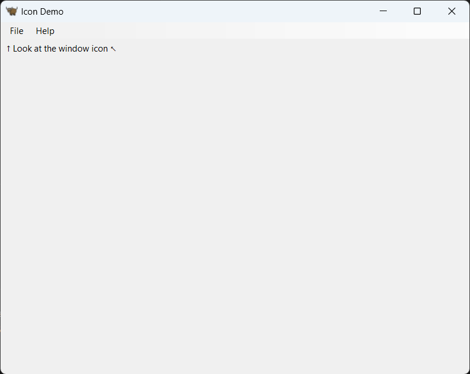
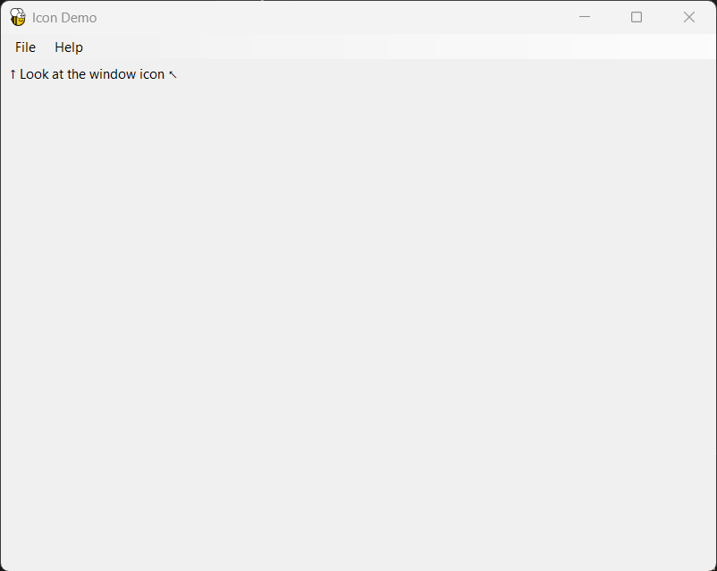

# toga-icon-bug
Demo showing that toga requires subclassing App to change the icon

# Running

1. Create a [virtual environment](https://docs.python.org/3/library/venv.html) and activate it.
1. Install toga:

    ```
    pip install toga
    ```

1. Run `python -m broken` or use the VS Code "Python Debugger: broken" launch configuration to run the broken version.

1. Notice that the main window's icon is the default Brutus bull:

    

    This module runs the code directly using `toga.App` as the application class. You can verify this and
    the application name and icon path in the console output:

    ```
    appclass=<class 'toga.app.App'>
    app.app_name='icon_demo'
    app.icon.path=WindowsPath('resources/icon_demo')
    ```

1. Run `python -m working` or use the VS Code "Python Debugger: working" launch configuration to confirm that using an empty subclass fixes the problem:

    

    The console output shows the class and settings:

    ```
    appclass=<class 'icon_demo.IconWorking'>
    app.app_name='icon_demo'
    app.icon.path=WindowsPath('resources/icon_demo')
    ```

# Credits

The icon files in `resources` are borrowed from toga-demo.

Everything else was created from scratch.
